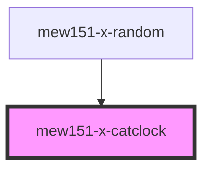

# mew151-x-catclock

<!-- Auto Generated Below -->

## Overview

A cat clock, based on xclock's cat display mode.

## Properties

| Property | Attribute | Description                                                                                      | Type     | Default     |
| -------- | --------- | ------------------------------------------------------------------------------------------------ | -------- | ----------- |
| `color`  | `color`   | The color of the bowtie to display. Accepts any valid CSS colors, and possibly a few bonus ones. | `string` | `'#a99cef'` |

## Dependencies

### Used by

 - [mew151-x-random](../mew151-x-random)

### Graph

----------------------------------------------

*Built with [StencilJS](https://stenciljs.com/)*
