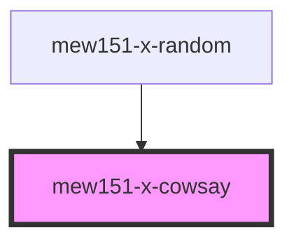

# mew151-x-cowsay

<!-- Auto Generated Below -->

## Overview

Renders cowsay in a "terminal"

## Properties

| Property | Attribute | Description                    | Type     | Default     |
| -------- | --------- | ------------------------------ | -------- | ----------- |
| `eyes`   | `eyes`    | Replacement eyes for the cow   | `string` | `undefined` |
| `mouth`  | `mouth`   | Replacement tongue for the cow | `string` | `undefined` |
| `text`   | `text`    | The text for the cow to say    | `string` | `'Moo!'`    |

## Dependencies

### Used by

 - [mew151-x-random](../mew151-x-random)

### Graph

----------------------------------------------

*Built with [StencilJS](https://stenciljs.com/)*
