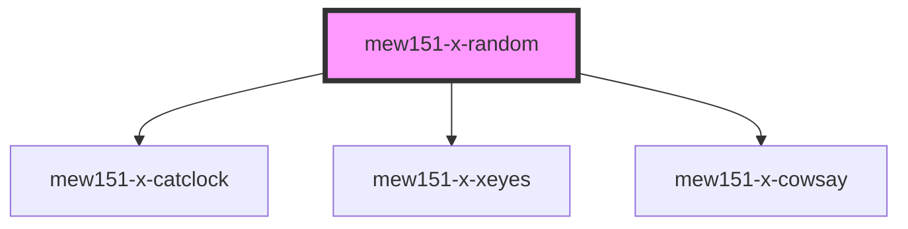

# mew151-x-random

<!-- Auto Generated Below -->

## Overview

The main component that shows UNIX desktop toys on Mew151.net!

## Properties

| Property                 | Attribute                  | Description                                             | Type                                | Default     |
| ------------------------ | -------------------------- | ------------------------------------------------------- | ----------------------------------- | ----------- |
| `biblicallyAccurateOdds` | `biblically-accurate-odds` | Odds of biblically accurate xeyes                       | `number`                            | `1 / 256`   |
| `forceSelection`         | `force-selection`          | Allows a page to force a specific desktop toy to appear | `"catclock" \| "cowsay" \| "xeyes"` | `undefined` |
| `residentOdds`           | `resident-odds`            | Odds of getting a The Residents xeyes                   | `number`                            | `0`         |
| `tieColor`               | `tie-color`                | The color of the cat clock's tie                        | `string`                            | `undefined` |

## Dependencies

### Depends on

- [mew151-x-catclock](../mew151-x-catclock)
- [mew151-x-xeyes](../mew151-x-xeyes)
- [mew151-x-cowsay](../mew151-x-cowsay)

### Graph

----------------------------------------------

*Built with [StencilJS](https://stenciljs.com/)*
