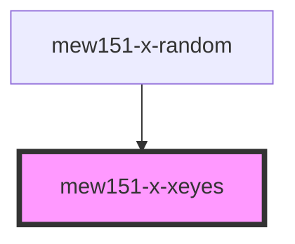

# mew151-x-xeyes

<!-- Auto Generated Below -->

## Properties

| Property             | Attribute             | Description                                     | Type      | Default     |
| -------------------- | --------------------- | ----------------------------------------------- | --------- | ----------- |
| `biblicallyAccurate` | `biblically-accurate` | Whether the eyes are biblically accurate or not | `boolean` | `false`     |
| `height`             | `height`              | The height of the canvas                        | `number`  | `undefined` |
| `theResidentsMode`   | `the-residents-mode`  | Whether The Residents are watching or not       | `boolean` | `false`     |
| `width`              | `width`               | The width of the canvas                         | `number`  | `undefined` |

## Dependencies

### Used by

 - [mew151-x-random](../mew151-x-random)

### Graph

----------------------------------------------

*Built with [StencilJS](https://stenciljs.com/)*
